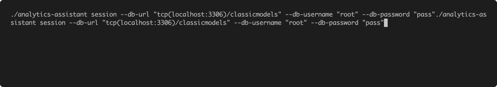

# Analytics Assistant CLI
The Data Analytics Assistant is a command-line interface (CLI) tool designed to assist users in obtaining insights from their MySQL databases using natural language questions. By leveraging the power of OpenAI's API, users can easily ask questions about their data, and the assistant will provide answers based on the information stored in the database.

## Requirements
- Go 1.18 or later
- A MySQL database
- An OpenAI API key
## Installation

```bash
curl -s https://raw.githubusercontent.com/FonsecaGoncalo/analytics-assistant/main/installer.sh | bash
```

### Install From Sources
- Clone the repository:
```bash
git clone https://github.com/FonsecaGoncalo/analytics-assistant.git
```
Navigate to the project directory:
```bash
cd analytics-assistant
```
Build the CLI tool:
```bash
go build -o analytics-assistant
```
This will create an executable named analytics-assistant in the current directory.

## Usage
```
Usage:
analytics-assistant session [flags]

Flags:
-c, --context-file string   Path to a file containing business context
-p, --db-password string    MySQL database password
-u, --db-url string         MySQL database URL
-n, --db-username string    MySQL database username
-h, --help                  help for session
-s, --log-sql               Log SQL
```

To use the CLI tool, you will first need to set and environment variable with the openai API key:
```bash
export OPENAI_API_KEY="{you_openai_api_key}"
```

And then run:
```bash
analytics-assistant session --db-url "tcp(localhost:3306)/your_database_name" --db-username "your_username" --db-password "your_password"
```
Replace `your_database_name`, `your_username`, and `your_password` with the appropriate values for your MySQL database. This will initiate an interactive session with the data analyst assistant.

To provide the assistant with additional context when responding to questions, supply a file containing business rules or database field descriptions using the `--context-file` flag.

### Demo


## License
This project is licensed under the [MIT License](./LICENSE).
